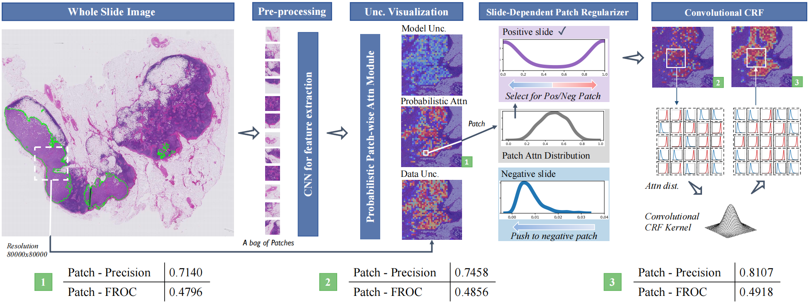

# Bayes-MIL: A New Probabilistic Perspective on Attention-based Multiple Instance Learning for Whole Slide Images

This repository is the implementation of [Bayes-MIL: A New Probabilistic Perspective on Attention-based Multiple Instance Learning for Whole Slide Images](https://openreview.net/forum?id=_geIwiOyUhZ). 



## Requirements

Use the environment configuration the same as [CLAM](https://github.com/mahmoodlab/CLAM).


## Data preprocessing

1. Create patches
```shell
python create_patches_fp.py --source DIR_TO_SLIDE_FILE --save_dir SAVE_DIR --patch_size 256 --seg --patch --stitch
```

2. Extract patch features
```shell
CUDA_VISIBLE_DEVICES=0,1 python extract_features_fp.py --data_h5_dir DIR_TO_COORDS --data_slide_dir DATA_DIRECTORY --csv_path CSV_FILE_NAME --feat_dir FEATURES_DIRECTORY --batch_size 512 --slide_ext .svs
```

3. Prepare the data in the `dataset_csv` folder.
   
   Datasets are expected to be prepared in a csv format containing at least 3 columns: case_id, slide_id, and labels columns for the slide-level labels. 


4. Split the data into k-fold(e.g. 10-fold), then save the splited data in the following format as in `splits/x/splits_x.csv`.
```bash
python create_splits_seq.py --task task_1_tumor_vs_normal --seed 1 --label_frac 0.75 --k 10
```

5. Calculate the shape of images.

Create a `images_shape.txt` file that stored with slide name, width and height of each slide at level 0.
```bash
python get_image_shape.py
```

## Training
1. Modify the format of the input data.

For data loading, look under `datasets/dataset_generic.py`:
```bash
	def __getitem__(self, idx):
		slide_id = self.slide_data['slide_id'][idx]
		label = self.slide_data['label'][idx]
		if type(self.data_dir) == dict:
			source = self.slide_data['source'][idx]
			data_dir = self.data_dir[source]
		else:
			data_dir = self.data_dir

		full_path = os.path.join(data_dir, 'h5_files', '{}.h5'.format(slide_id))
		with h5py.File(full_path, 'r') as hdf5_file:
			features = hdf5_file['features'][:]
			coords = hdf5_file['coords'][:]

		features = torch.from_numpy(features)
		coords = torch.from_numpy(coords)
		w, h = self.shape_dict[slide_id]
		return slide_id, features, label, coords, w, h
```
* `slide_id`: Name of slide.
* `features`: Features of all patches in the slide.
* `label`: Label of slide (0 or 1)
* `coords`: The top-left coordinates of all patches in the slide.
* `w`: Width of the slide.
* `h`: Height of the slide.


2. Bayes-MIL.

We consider 3 variants of Bayes-MIL: 1) Bayes-MIL-Vis: The Bayesian modelling of MIL. 2) Bayes-MIL-SDPR: The model with slide-dependent patch regularizer. 3) Bayes-MIL-APCRF: The whole model, including SDPR and the approximate CRF.


For training, look under `models/model_bmil.py`:
```bash
bMIL_model_dict = {
                    'vis': probabilistic_MIL_Bayes_vis,
                    'enc': probabilistic_MIL_Bayes_enc,
                    'spvis': probabilistic_MIL_Bayes_spvis,          
}
```
>📋 Update `--model_type` to the corresponding model. 
* `bmil-vis`: Bayes-MIL-Vis
* `bmil-enc`: Bayes-MIL-SDPR
* `bmil-spvis`: Bayes-MIL-APCRF

```shell
CUDA_VISIBLE_DEVICES=0 nohup python -u main.py --drop_out --early_stopping --lr 1e-4 --k 10 --label_frac 0.75 --exp_code task_1_tumor_vs_normal_CLAM_75 --weighted_sample --bag_loss ce --inst_loss svm --task task_1_tumor_vs_normal --model_type bmil-vis --log_data --data_root_dir FEATURES_DIRECTORY &
```


## Evaluation
By adding your own custom datasets into `eval.py` the same way as you do for `main.py`. Modify the `--model_type` to the corresponding model.
```bash
CUDA_VISIBLE_DEVICES=0 python eval.py --drop_out --k 10 --models_exp_code task_1_tumor_vs_normal_CLAM_75 --save_exp_code task_1_tumor_vs_normal_CLAM_75 --task task_1_tumor_vs_normal --model_type bmil-vis --results_dir results --data_root_dir DATA_ROOT_DIR
```

## Heatmap Visualization

Modify the `heatmaps/configs/config_template.yaml` to filling out the config. The heatmaps will be saved in `heatmaps/heatmap_raw_results`.
```shell
CUDA_VISIBLE_DEVICES=0 nohup python -u create_heatmaps_bmil.py --config config_template.yaml &
```
